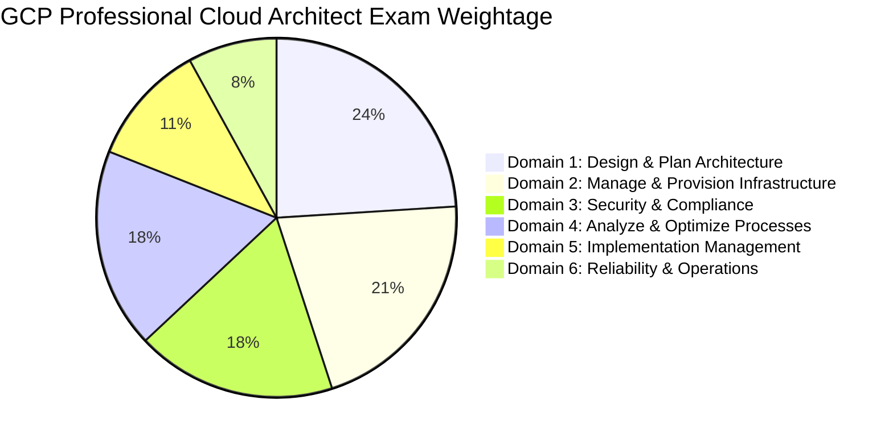

# Google Cloud Certified Professional Cloud Architect (PCA) - Comprehensive Exam & Syllabus Guide

> [!IMPORTANT]
> **A Note on Certification Integrity & "Exam Dumps":**
> Google Cloud strictly enforces certification integrity policies. Using or sharing actual leaked exam questions ("brain dumps") violates Google's Non-Disclosure Agreement (NDA) and can lead to **permanent revocation of certifications and banning from future Google Cloud exams**. 
> 
> To pass the exam with confidence and build real architectural competence, the proven approach is to master **scenario-based decision making**, **Google Cloud Well-Architected principles**, and **Case Study analysis** using official sample questions and domain-focused practice scenarios provided in this repository.

---

## 1. Exam Structure Overview

| Parameter | Details |
| :--- | :--- |
| **Exam Duration** | 2 Hours (120 minutes) |
| **Question Format** | 50 - 60 Multiple Choice and Multiple Select questions |
| **Case Study Questions** | ~20% - 30% of total questions (approx. 2-3 case studies per exam) |
| **Prerequisites** | None (3+ years of industry experience including 1+ years designing GCP solutions recommended) |
| **Validity** | 2 Years |

---

## 2. Official Syllabus Breakdown (The 6 Domains)



### **Domain 1: Designing and Planning a Cloud Solution Architecture (~24%)**
* **1.1 Design high-performing, scalable, and resilient infrastructure:** Multi-region deployments, autoscaling rules, load balancing strategies (Global HTTP/S, TCP/UDP Proxy, Network LB).
* **1.2 Design storage and database strategies:** Selecting transactional vs analytical databases (Spanner vs Bigtable vs Cloud SQL vs BigQuery vs Firestore).
* **1.3 Compute resources design:** Choosing Serverless (Cloud Run, Cloud Functions) vs Managed Containers (GKE / GKE Autopilot) vs IaaS (Compute Engine instance groups).
* **1.4 Hybrid and Multi-Cloud connectivity:** Dedicated Interconnect, Partner Interconnect, HA Cloud VPN, Anthos / GKE Enterprise.

### **Domain 2: Managing and Provisioning the Cloud Solution Infrastructure (~21%)**
* **2.1 Infrastructure as Code (IaC):** Terraform state locking in Cloud Storage, modular templates, CI/CD pipeline triggers (Cloud Build).
* **2.2 Network Configuration:** Shared VPC (Host vs Service projects), VPC Peering limits, Private Service Connect (PSC), Cloud NAT, Private Google Access.
* **2.3 Provisioning Automation:** Service accounts, deployment manager/Terraform, image management (packer, artifact registry).

### **Domain 3: Designing for Security and Compliance (~18%)**
* **3.1 Identity and Access Management (IAM):** Least privilege, Workload Identity Federation, Service Account Key hygiene, Custom IAM Roles.
* **3.2 Security Controls:** BeyondCorp Zero Trust, Identity-Aware Proxy (IAP), Cloud Armor (DDoS & WAF rules), VPC Service Controls perimeters.
* **3.3 Data Protection:** Sensitive Data Protection (DLP API), Customer-Managed Encryption Keys (CMEK) via Cloud KMS/HSM, Cloud Storage lifecycle compliance retention.

### **Domain 4: Analyzing and Optimizing Technical and Business Processes (~18%)**
* **4.1 Technical process optimization:** CI/CD pipeline optimization, testing strategies, canary deployments.
* **4.2 Business process & Cost optimization:** Committed Use Discounts (CUDs), BigQuery table partitioning & clustering, Object Lifecycle Management, preemptible/Spot VMs.
* **4.3 Software Development Lifecycle (SDLC):** Application migration strategies (6 Rs: Rehost, Replatform, Refactor, Retire, Retain, Repurchase).

### **Domain 5: Managing Implementations of Cloud Architecture (~11%)**
* **5.1 Migration planning:** Database Migration Service (DMS), Datastream, Storage Transfer Service, Transfer Appliance.
* **5.2 Microservices modernization:** API gateway management (Apigee / Cloud Endpoints), containerization best practices, service mesh (Istio/ASM).

### **Domain 6: Ensuring Solution and Operations Reliability (~8%)**
* **6.1 Observability:** Cloud Monitoring metrics, Cloud Logging sinks, Cloud Trace, Error Reporting.
* **6.2 SRE Principles:** Service Level Indicators (SLIs), Service Level Objectives (SLOs), Error Budget Burn Rate alerts.
* **6.3 Disaster Recovery (DR):** RTO/RPO trade-offs, Active-Active (Hot Standby) vs Active-Passive (Warm/Cold Standby).

---

## 3. Official Case Studies Deep Dive

The PCA exam places heavy emphasis on 4 active case studies. Questions test your architectural judgment under specific technical and business constraints.

### 🏢 **1. Cymbal Retail**
* **Business Goal:** Modernize traditional online retail platform, handle holiday traffic spikes, implement Generative AI shopping assistant.
* **Key Architecture:**
  * **Transactional Database:** Cloud Spanner (multi-region, global consistency, high traffic scaling).
  * **Compute:** Cloud Run for microservices (serverless, scales to zero) or GKE Autopilot.
  * **AI Integration:** Vertex AI Search & Conversation / Vector Search with RAG grounded on catalog data.
  * **Global Traffic:** Global External Application Load Balancer with Cloud Armor and Cloud CDN.

### 🏥 **2. EHR Healthcare**
* **Business Goal:** Migrate legacy healthcare SaaS from colocation data center to GCP with strict HIPAA compliance, 99.99% availability, and patient data privacy.
* **Key Architecture:**
  * **On-Premises Connection:** Dedicated Interconnect (10 Gbps) with MACsec/IPsec for private RFC 1918 routing.
  * **Security:** Workload Identity on GKE, CMEK in Cloud KMS, VPC Service Controls.
  * **Data Privacy:** Sensitive Data Protection (Cloud DLP) for automated masking of PHI/PII prior to BigQuery analytics.

### 🎥 **3. Altostrat Media**
* **Business Goal:** High-throughput processing of global video/audio streaming assets, cost optimization for petabyte-scale storage, real-time clickstream analytics.
* **Key Architecture:**
  * **Streaming Data Pipeline:** Pub/Sub -> Cloud Dataflow -> BigQuery.
  * **Storage Optimization:** Cloud Storage Object Lifecycle Management (Standard -> Nearline -> Coldline -> Archive).
  * **Ad-Hoc Analytics:** BigQuery with Date Partitioning and Clustering on video metadata.

### 🚗 **4. KnightMotives Automotive**
* **Business Goal:** Connected vehicle telemetry ingestion, edge computing in manufacturing plants, multi-region disaster recovery (RTO < 1 min, RPO ≈ 0).
* **Key Architecture:**
  * **Telemetry Ingestion:** Cloud IoT Core / Pub/Sub into Cloud Bigtable for ultra-low latency write throughput.
  * **Disaster Recovery:** Active-Active cross-region GKE clusters with Cloud Spanner multi-region dual-region failover.
  * **Edge Computing:** GKE Enterprise / Anthos Bare Metal deployed at regional manufacturing facilities.

---

## 4. Master GCP Architectural Decision Matrices

### **A. Database & Data Storage Selection Matrix**

```
                                  Is data relational (SQL)?
                                 /                         \
                             YES                             NO
                             /                                 \
           Needs multi-region horizontal scaling?          Is it unstructured document/object data?
                   /                    \                          /                  \
                YES                      NO                     YES                    NO
                /                          \                    /                        \
          Cloud Spanner                 Cloud SQL           Is it JSON/Mobile?      High Throughput NoSQL?
   (Global ACID, 99.999%)           (PostgreSQL/MySQL)      /              \          /               \
                                                        Firestore       Cloud Storage   Cloud Bigtable  Memorystore
                                                       (Document API)  (Objects/Blobs)  (Sub-10ms Wide) (In-Memory Redis)
```

| Requirement / Use Case | Recommended Service | Scalability & Limits | Primary Trade-Off |
| :--- | :--- | :--- | :--- |
| **Global Relational Transactional (ACID)** | **Cloud Spanner** | Unlimited horizontal scaling, 99.999% SLA | Higher baseline cost than Cloud SQL |
| **Regional Managed SQL (PostgreSQL/MySQL)** | **Cloud SQL** | Up to 64TB storage, 99.95% SLA | Primary instance scale-up limit (no horizontal write scaling) |
| **High-Throughput Telemetry / IoT NoSQL** | **Cloud Bigtable** | Petabyte-scale wide-column, sub-10ms reads/writes | No SQL joins; requires key design planning |
| **Mobile / Web Hierarchical Document NoSQL** | **Firestore (Native)** | Multi-region, offline client sync, live queries | 1 request/sec write rate limit per document |
| **Data Warehouse Analytics / Big Data SQL** | **BigQuery** | Serverless petabyte parallel SQL, BI Engine | Not designed for single-row sub-10ms transactional updates |
| **Shared POSIX File Storage (NFSv3)** | **Cloud Filestore** | Up to 100+ TB shared filesystem | Higher cost than object storage |
| **Unstructured Binary / Media Objects** | **Cloud Storage** | Unlimited capacity, Standard/Nearline/Coldline/Archive | Object key storage; not a POSIX filesystem |

---

### **B. Compute Selection Matrix**

| Criteria | Cloud Run | GKE Autopilot | GKE Standard | Compute Engine VMs | Cloud Functions (2nd Gen) |
| :--- | :--- | :--- | :--- | :--- | :--- |
| **Workload Type** | Stateless Containers | Container Microservices | Custom Kube Tooling | Monoliths / Legacy / VMs | Event Triggers / Micro-tasks |
| **Server Management** | Zero (100% Serverless) | Managed K8s Nodes | Full K8s Control | Full OS Administration | Zero (100% Serverless) |
| **Scaling Capability** | Instant (Scale to 0) | Pod/Node Autoscaling | HPA + Cluster Autoscaler | MIG Autoscaler | Instant (Scale to 0) |
| **Billing Model** | Per-millisecond execution | Per-pod requested vCPU/RAM | Per-provisioned node VM | 24/7 provisioned VM rate | Per-millisecond execution |
| **Max Execution Time** | 60 mins (Default 5 min) | Unlimited | Unlimited | Unlimited | 60 mins (Default 5 min) |
| **Custom Kernel/GPU** | Limited GPU support | Full GPU support | Full GPU & Custom Kernel | Full OS / Kernel / GPU | No custom kernel/GPU |

---

### **C. Hybrid & Enterprise Networking Decision Matrix**

| Requirement | Recommended Solution | Bandwidth / SLA | Key Characteristic |
| :--- | :--- | :--- | :--- |
| **Private Dedicated Fiber (No Internet)** | **Dedicated Interconnect** | 10 Gbps / 100 Gbps (99.99% SLA) | Direct physical connection at GCP co-location facility |
| **Private Carrier Fiber (No Co-location)** | **Partner Interconnect** | 50 Mbps to 10 Gbps | Routed via authorized service provider network |
| **Encrypted Public Internet Tunnel** | **HA Cloud VPN** | Up to 3 Gbps per tunnel (99.99% SLA) | IPsec IKEv2 over public internet |
| **Private Egress to 3rd-Party SaaS** | **Private Service Connect (PSC)** | Dynamic internal IP endpoint | Producer-consumer unidirectional endpoint (No CIDR overlaps) |
| **Connecting 50+ Projects Internally** | **Shared VPC** | Native VPC throughput | Central Host project manages network/subnets for Service projects |
| **Transitive Hub-and-Spoke Routing** | **Network Connectivity Center (NCC)** | Dynamic BGP route exchange | Connects VPCs, Interconnects, and SD-WAN branch appliances |

---

### **D. Security, IAM & Data Encryption Matrix**

| Security Domain | Recommended Tool / Pattern | Exam Key Rationale |
| :--- | :--- | :--- |
| **GKE Pod Security** | **Workload Identity** | Eliminates service account JSON keys by binding KSA to GSA |
| **Cross-Cloud Auth (AWS/Azure)** | **Workload Identity Federation** | Uses OIDC/SAML tokens instead of long-lived GCP credentials |
| **Zero Trust Remote Access** | **Identity-Aware Proxy (IAP)** | Replaces VPN by verifying user identity + device context at Layer 7 |
| **Data Exfiltration Perimeter** | **VPC Service Controls** | Blocks API-level data movement outside designated project boundaries |
| **Web WAF & DDoS Protection** | **Cloud Armor** | Edge protection on Global External Load Balancers (SQLi, XSS, rate limiting) |
| **Customer Key Control** | **Customer-Managed Encryption Keys (CMEK)** | Full key rotation & instant key revocation via Cloud KMS / HSM |
| **Automated PII/PHI Masking** | **Sensitive Data Protection (DLP)** | Redacts/tokenizes SSN, credit cards, and medical data before storage |
| **Container Signature Enforcer** | **Binary Authorization** | Blocks deployment of un-signed or un-scanned container images on GKE |
| **Immutable Storage Compliance** | **Cloud Storage Bucket Lock (WORM)** | Enforces legal holds and non-rewritable storage for 1-10 years |

---

### **E. Data Analytics, Messaging & AI Architecture Matrix**

| Pattern / Requirement | Recommended Service | Operational Characteristic |
| :--- | :--- | :--- |
| **Global Real-Time Event Buffering** | **Cloud Pub/Sub** | Serverless, decoupled publisher/subscriber ingestion |
| **Rate-Limited Task Queue & Retries** | **Cloud Tasks** | Explicit rate throttling (e.g. 10 req/sec) and scheduled delivery delays |
| **Unified Event Routing (CloudEvents)** | **Eventarc** | Asynchronously triggers Cloud Run/Functions from 90+ GCP sources |
| **Stream & Batch ETL Processing** | **Cloud Dataflow** | Managed Apache Beam with exactly-once processing guarantees |
| **Managed Apache Spark/Hadoop** | **Dataproc / Dataproc Serverless** | Big data batch processing; Serverless mode eliminates cluster management |
| **Python DAG Pipeline Orchestration** | **Cloud Composer** | Managed Apache Airflow for complex ETL workflow dependency management |
| **Enterprise Search & RAG AI** | **Vertex AI Search & Conversation** | Grounds Gemini LLMs on enterprise data without model re-training |
| **Sub-Second Dashboard Acceleration** | **BigQuery BI Engine** | In-memory query acceleration for Looker / Tableau analytical dashboards |

---

### **F. Migration Tooling Selection Matrix**

| Migration Scenario | Recommended GCP Tool | Migration Mode |
| :--- | :--- | :--- |
| **VM Data Center Evacuation (Lift & Shift)** | **Migrate to Compute Engine** | Streaming VM disk replication directly to GCE VMs |
| **VM Monolith to Containers** | **Migrate to Containers (Migrate for Anthos)** | Automates extracting VM applications into GKE Docker containers |
| **Live Database Migration (Zero Downtime)** | **Database Migration Service (DMS)** | Continuous Change Data Capture (CDC) replication to Cloud SQL |
| **Continuous Database CDC to BigQuery** | **Datastream** | Serverless streaming replication from Oracle/MySQL into BigQuery |
| **Bulk Offline File Transfer (>20 TB)** | **Cloud Transfer Appliance** | Physical secure storage rack shipped to Google data center |
| **Online Storage Bucket Transfer** | **Storage Transfer Service** | Automated cloud-to-cloud or S3-to-GCS bucket object migration |

---

## 5. Official Practice & Learning Resources

1. **Official Google Cloud Exam Guide:** [cloud.google.com/certification/cloud-architect](https://cloud.google.com/certification/cloud-architect)
2. **Official GCP Sample Questions:** Available on Google Cloud Certification portal.
3. **Google Cloud Architecture Center:** [cloud.google.com/architecture](https://cloud.google.com/architecture)
4. **Google Cloud Skills Boost:** Professional Cloud Architect Learning Path.

---

*Repository maintained for GCP Professional Cloud Architect Exam Prep.*
